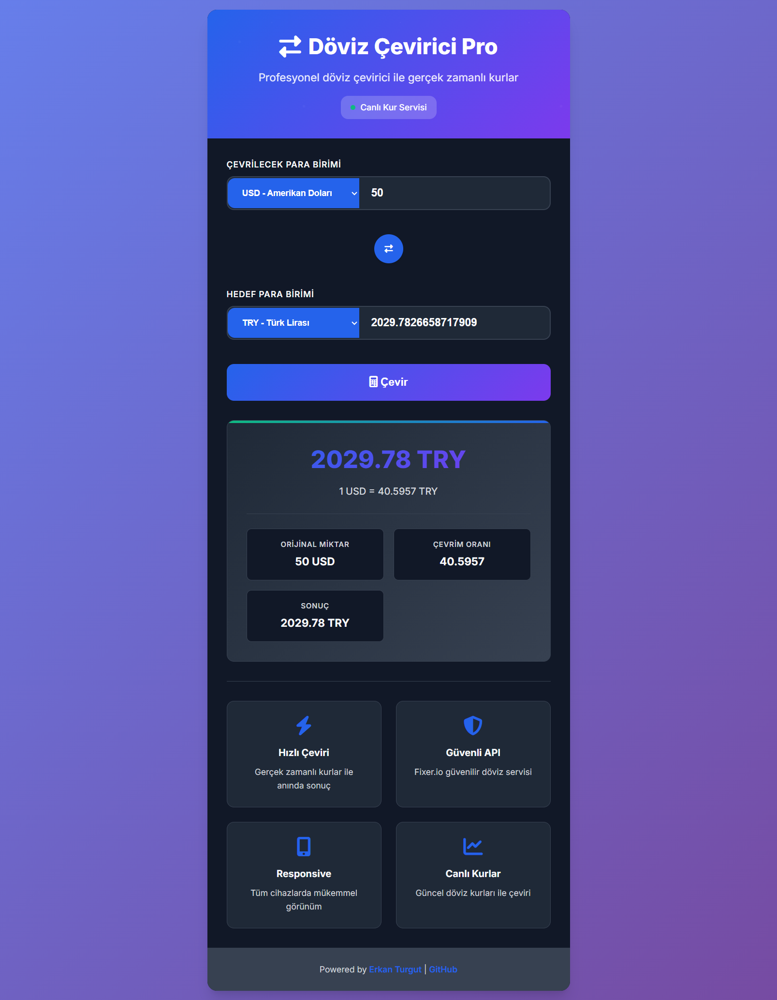

# 💱 Currency Converter Pro

A modern, responsive web application for real-time currency conversion using Flask and the Fixer.io API. Built with a beautiful UI and comprehensive error handling.





## ✨ Features

- **Real-time Exchange Rates**: Get live currency rates from Fixer.io API
- **Modern UI/UX**: Beautiful, responsive design with smooth animations
- **Multiple Currencies**: Support for major world currencies (USD, EUR, TRY, GBP, JPY, etc.)
- **Cross-currency Conversion**: Convert between any supported currency pair
- **Auto-refresh**: Automatic conversion on input changes
- **Error Handling**: Comprehensive error handling and user feedback
- **Mobile Responsive**: Works perfectly on all devices
- **Dark Mode Support**: Automatic dark mode detection
- **Professional Logging**: Detailed logging for debugging and monitoring

## 🚀 Quick Start

### Prerequisites

- Python 3.8 or higher
- pip (Python package installer)

### Installation

1. **Clone the repository**
   ```bash
   git clone https://github.com/Erkan3034/Flask-Fixer.io_ile_Doviz_Cevirici.git
   cd Flask-Fixer.io_ile_Doviz_Cevirici
   ```

2. **Install dependencies**
   ```bash
   pip install -r requirements.txt
   ```

3. **Set up environment variables**
   
   Create a `.env` file in the project root:
   ```env
   API_KEY=your_fixer_io_api_key_here
   ```
   
   Get your free API key from [Fixer.io](https://fixer.io/)

4. **Run the application**
   ```bash
   python app.py
   ```

5. **Access the application**
   
   Open your browser and navigate to: `http://localhost:5000`

## 📋 Requirements

- **Flask 2.3.3**: Web framework
- **requests 2.31.0**: HTTP library for API calls
- **Fixer.io API Key**: Free account required

## 🏗️ Project Structure

```
Flask-Fixer.io_ile_Doviz_Cevirici/
├── app.py                 # Main Flask application
├── requirements.txt       # Python dependencies
├── README.md             # Project documentation
├── app.log              # Application logs
├── .env                 # Environment variables (create this)
├── .gitignore          # Git ignore file
├── templates/
│   └── index.html      # Main application template
└── img/
    └── ss.png          # Screenshots
```

## 🔧 Configuration

### Environment Variables

| Variable | Description | Required |
|----------|-------------|----------|
| `API_KEY` | Your Fixer.io API key | Yes |

### API Setup

1. Visit [Fixer.io](https://fixer.io/)
2. Sign up for a free account
3. Get your API key from the dashboard
4. Add the API key to your `.env` file

## 🎯 Usage

### Web Interface

1. **Select Source Currency**: Choose the currency you want to convert from
2. **Enter Amount**: Input the amount you want to convert
3. **Select Target Currency**: Choose the currency you want to convert to
4. **Click Convert**: Get instant results with live exchange rates

### Features

- **Swap Currencies**: Click the swap button to quickly switch between currencies
- **Auto-conversion**: Results update automatically when you change inputs
- **Real-time Rates**: All rates are fetched live from Fixer.io
- **Error Handling**: Clear error messages for invalid inputs or API issues

## 🔌 API Endpoints

### POST `/api/convert`

Convert currencies via AJAX API.

**Request Body:**
```json
{
  "amount": 100,
  "fromCurrency": "USD",
  "toCurrency": "TRY"
}
```

**Response:**
```json
{
  "converted_amount": 2750.50,
  "rate": 27.505,
  "from_currency": "USD",
  "to_currency": "TRY"
}
```

## 🛠️ Development

### Running in Development Mode

```bash
python app.py
```

The application will run on `http://localhost:5000` with debug mode enabled.

### Logging

The application includes comprehensive logging:
- Console output for development
- File logging to `app.log`
- Error tracking and debugging information

### Code Structure

- **`app.py`**: Main Flask application with routes and business logic
- **`templates/index.html`**: Single-page application with modern UI
- **Error Handling**: Comprehensive try-catch blocks and user feedback
- **API Integration**: Clean integration with Fixer.io API

## 🎨 UI Features

- **Modern Design**: Clean, professional interface
- **Responsive Layout**: Works on desktop, tablet, and mobile
- **Smooth Animations**: CSS transitions and JavaScript animations
- **Dark Mode**: Automatic dark mode detection
- **Loading States**: Visual feedback during API calls
- **Error States**: Clear error messages and validation

## 🔒 Security

- **Environment Variables**: API keys stored securely
- **Input Validation**: Server-side validation of all inputs
- **Error Handling**: No sensitive information in error messages
- **HTTPS Ready**: Configured for production deployment

## 🚀 Deployment

### Local Production

```bash
# Install production dependencies
pip install gunicorn

# Run with Gunicorn
gunicorn -w 4 -b 0.0.0.0:5000 app:app
```

### Cloud Deployment

The application is ready for deployment on:
- **Heroku**
- **PythonAnywhere**
- **DigitalOcean**
- **AWS**
- **Google Cloud Platform**

### Environment Setup for Production

```bash
# Set environment variables
export API_KEY=your_production_api_key
export FLASK_ENV=production
```

## 📊 Monitoring

The application includes:
- **Application Logs**: Detailed logging in `app.log`
- **API Monitoring**: Track API calls and responses
- **Error Tracking**: Comprehensive error logging
- **Performance Metrics**: Response time tracking

## 🤝 Contributing

1. Fork the repository
2. Create a feature branch (`git checkout -b feature/AmazingFeature`)
3. Commit your changes (`git commit -m 'Add some AmazingFeature'`)
4. Push to the branch (`git push origin feature/AmazingFeature`)
5. Open a Pull Request

## 📝 License

This project is licensed under the MIT License - see the [LICENSE](LICENSE) file for details.

## 👨‍💻 Author

**Erkan Turgut**

- Website: [https://erkanturgut.netlify.app](https://erkanturgut.netlify.app)
- GitHub: [@Erkan3034](https://github.com/Erkan3034)

## 🙏 Acknowledgments

- [Fixer.io](https://fixer.io/) for providing the currency exchange API
- [Flask](https://flask.palletsprojects.com/) for the web framework
- [Font Awesome](https://fontawesome.com/) for the icons
- [Google Fonts](https://fonts.google.com/) for the typography


⭐ **Star this repository if you find it helpful!**